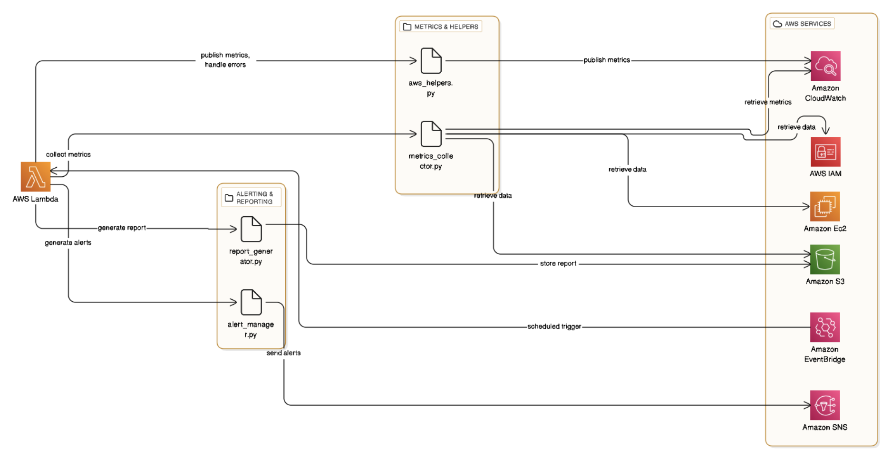

# AWS Cloud Security Monitoring Dashboard

An enterprise-grade serverless security monitoring solution that provides automated compliance tracking, real-time threat detection, and comprehensive security reporting for AWS infrastructure. This production-ready system delivers continuous visibility into security posture through automated metric collection, intelligent threshold analysis, and proactive alerting.

## Overview

This security monitoring system addresses the critical need for continuous security compliance monitoring in cloud environments. Built using serverless architecture principles, the solution automatically scales to handle varying workloads while maintaining minimal operational overhead. The system continuously tracks security best practices across IAM, S3, EC2, and security groups, providing security teams with actionable insights and immediate notifications when violations are detected.

The architecture leverages AWS managed services to ensure high availability and reliability. EventBridge schedules trigger Lambda functions for automated metric collection, eliminating the need for dedicated infrastructure. All collected metrics are published to CloudWatch for real-time visualization, while comprehensive reports are generated and stored in S3 for historical analysis and audit purposes.

## Architecture

The system follows an event-driven, serverless architecture pattern that ensures scalability and cost-effectiveness. The core orchestration is handled by an AWS Lambda function that is triggered on a scheduled basis by Amazon EventBridge. This Lambda function coordinates metric collection, analysis, alerting, and reporting through a modular codebase structure.



The architecture diagram above illustrates the complete data flow. The Lambda function serves as the central orchestrator, invoking specialized Python modules for different responsibilities. The metrics collector module queries AWS IAM, EC2, and S3 services to gather security-related data. Collected metrics are then published to CloudWatch for dashboard visualization, analyzed for threshold violations, and used to generate comprehensive reports stored in S3. When security violations are detected, the alert manager sends notifications through SNS to subscribed endpoints.

This design ensures separation of concerns, with each module handling a specific responsibility. The shared utilities module provides common functionality for AWS API interactions, error handling, and logging, promoting code reuse and maintainability.

## Security Metrics

The system monitors four primary metric categories, tracking six key security indicators that align with AWS security best practices:

**IAM Security**
- MFA compliance status across all IAM users
- Detection of users without MFA enabled

**Data Encryption**
- EBS volume encryption compliance
- Identification of unencrypted volumes

**Exposure Risks**
- Public S3 bucket detection
- EC2 instances with public IP addresses

**Network Security**
- Risky security group rules (0.0.0.0/0 access)
- Open ports exposing sensitive services

Each metric is collected using direct API calls through the Boto3 SDK, ensuring accurate and up-to-date information. The metrics are then evaluated against configurable thresholds to determine if security violations have occurred.

## Core Components

### Metrics Collection

The metrics collection module implements comprehensive security checks using AWS APIs. Built with Boto3, the module makes direct API calls to EC2, S3, and IAM services to gather security-related information. Key features include:

- Robust error handling and logging to ensure reliability even when individual API calls fail
- Modular function design with each security check implemented as a separate function
- Direct integration with AWS service APIs for real-time data collection
- Configurable collection intervals and retry logic

### Lambda Orchestration

The main Lambda handler serves as the execution engine that coordinates all system operations. When triggered by EventBridge, it executes the following workflow:

1. Collects metrics from multiple AWS services through the metrics collector module
2. Analyzes collected data against predefined thresholds to identify security risks
3. Publishes metrics to CloudWatch for real-time dashboard visualization
4. Triggers alerts through SNS when violations are detected
5. Optionally generates comprehensive reports and stores them in S3 (controlled via environment variables)

### Alert Management

The alert management system implements intelligent threshold-based alerting with the following capabilities:

- Configurable thresholds per metric type
- Structured alert messages with actionable details
- Multi-channel notifications through SNS (email, SMS, or other subscribed endpoints)
- Alert deduplication to prevent notification fatigue

### Reporting System

The reporting module generates automated security reports in JSON format with the following features:

- Daily reports providing timestamped snapshots of current security posture
- Weekly reports aggregating data over time to identify trends and patterns
- S3 storage with date-based organization for easy retrieval and analysis
- Optional functionality controlled through environment variables for flexibility

### Infrastructure as Code

The complete infrastructure is defined in a CloudFormation template, enabling repeatable and version-controlled deployments. The template provisions:

- SNS topic for alert notifications
- S3 bucket with encryption enabled for report storage
- IAM roles with least-privilege permissions
- EventBridge rule for scheduled execution
- CloudWatch dashboard with pre-configured widgets for metric visualization

## Technology Stack

The solution is built entirely on AWS managed services, ensuring high availability and eliminating infrastructure management overhead:

- **Runtime**: Python 3.9+ for Lambda functions
- **SDK**: Boto3 for AWS service integration
- **Infrastructure**: CloudFormation YAML templates following Infrastructure as Code best practices
- **Compute**: AWS Lambda for serverless execution
- **Monitoring**: Amazon CloudWatch for metrics, logs, and dashboards
- **Scheduling**: Amazon EventBridge for scheduled triggers
- **Notifications**: Amazon SNS for alert delivery
- **Storage**: Amazon S3 for report storage
- **Security**: AWS IAM for access control and CloudTrail for audit logging

## Deployment

Deployment begins with the CloudFormation template, which provisions all necessary AWS resources in a single operation. The template creates the SNS topic, S3 bucket, IAM roles, EventBridge rule, and CloudWatch dashboard. Once the infrastructure is deployed, the Lambda function code is packaged with its dependencies and uploaded to AWS Lambda.

Environment variables are configured to specify the SNS topic ARN for alerts and optionally the S3 bucket name for report storage. The Lambda function is configured to use the IAM execution role created by CloudFormation, which has been granted the minimum permissions necessary for the system to operate. The EventBridge rule triggers the Lambda function on a schedule, typically daily or hourly depending on monitoring requirements. After deployment, the CloudWatch dashboard provides immediate visibility into the collected metrics.

## Monitoring and Observability

The system provides comprehensive observability through multiple channels:

- **CloudWatch Dashboards**: Real-time visualization of all security metrics, enabling security teams to quickly assess current security posture
- **CloudWatch Logs**: Detailed execution logs with structured logging for troubleshooting and audit purposes
- **SNS Notifications**: Immediate alerts when security violations are detected, ensuring prompt notification of critical issues
- **S3 Report Storage**: Historical record of security compliance for trend analysis and audit requirements
- **CloudTrail Logging**: Complete audit trail of all API calls and system operations

## Security Best Practices

The implementation follows AWS security best practices throughout:

- **Least Privilege IAM**: Roles configured with minimum permissions necessary for each component to function
- **Encrypted Storage**: S3 bucket encryption enabled to protect sensitive security data
- **Secure Communication**: SNS topic policies restrict access to authorized subscribers
- **Audit Trail**: All system operations logged through CloudTrail for compliance and security reviews
- **Error Handling**: Comprehensive error handling ensures graceful degradation when individual components fail

## Project Context

This project was developed as part of the CMU 95-746 Cloud Security capstone course, demonstrating practical application of cloud security principles and serverless architecture design. The implementation showcases production-ready code with proper error handling, logging, and observability. The system demonstrates Infrastructure as Code principles through the complete CloudFormation template, automated reporting and alerting capabilities, and integration with multiple AWS services.

The modular codebase structure and comprehensive documentation reflect software engineering best practices, making the codebase maintainable and extensible. The system is designed to be easily extended with additional security metrics or enhanced with more sophisticated analysis capabilities.

## Project Structure

The codebase is organized into logical modules that separate concerns and promote maintainability:

```
aws-cloud-security-monitoring/
├── src/
│   ├── metrics_collector/
│   │   └── metrics_collector.py          # Security metric collection logic
│   ├── cloudformation/
│   │   └── dashboard_setup.yaml          # Complete IaC template
│   ├── lambda_handler/
│   │   ├── lambda_handler.py             # Main Lambda entry point
│   │   └── alert_manager.py              # Alert threshold logic
│   ├── reporting/
│   │   ├── report_generator.py           # Report generation
│   │   └── email_sender.py               # Notification formatting
│   └── utils/
│       └── aws_helpers.py               # Shared AWS utilities
├── docs/
│   ├── implementation-design.png         # Architecture diagram
│   └── project_plan.md                  # Original project planning document
└── README.md
```

The CloudFormation template defines the complete infrastructure in a single file, enabling version-controlled infrastructure deployments. Documentation and demo materials are organized in dedicated directories, keeping the repository structure clean and navigable.
